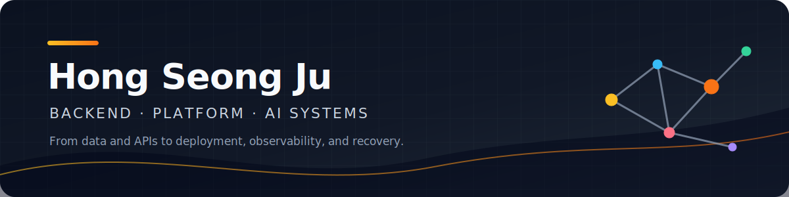

  

  
  
  
  

## Hello

I study Computer Science & Engineering at Soongsil University and build backend, platform, and AI
systems. My work connects data ingestion and APIs with deployment, observability, and recovery
rather than stopping at application code.

I value engineering that makes the problem, constraints, decisions, and verified results
explainable. I am currently looking for an entry-level or junior backend, platform, or AI backend
role.

## Tech Stack

  
  
  
  
  
  

  
  
  
  
  
  

  
  
  
  
  

## Featured Projects

### Soongsil Campus AI Platform

A four-service system connecting u-SAINT, LMS, library, and public campus data to a web application,
a natural-language agent, and standard MCP tools. I designed boundaries for authentication,
per-user state, approval-gated write operations, and external-system failures, and operate the
system with GitOps on ARM64 k3s.

| Service | Responsibility | Links |
| --- | --- | --- |
| ssuAI | User-facing web application and same-origin BFF | [Live](https://ssuai.vercel.app) · [Repository](https://github.com/ghdtjdwn/ssuAI) |
| ssuMCP | Campus data and MCP tools | [Repository](https://github.com/ghdtjdwn/ssuMCP) |
| ssuAgent | LangGraph routing, SSE, and HITL | [Repository](https://github.com/ghdtjdwn/ssuAgent) |
| ssu-ai-service | Isolated embedding-request gateway | [Repository](https://github.com/ghdtjdwn/ssu-ai-service) |

[Read the case study with architecture and operational evidence](https://seongju.vercel.app/en/projects/ssu-platform/)

### More projects

| Project | My scope | Links |
| --- | --- | --- |
| Geuneul | PostGIS spatial search, idempotent ETL, Spring/Next.js services, and AWS IaC | [Live](https://geuneul.vercel.app) · [Repository](https://github.com/ghdtjdwn/geuneul) · [Case study](https://seongju.vercel.app/en/projects/geuneul/) |
| Cham Domi | Full mobile web application and roommate-matching backend. Authentication and dormitory eligibility were teammate-owned | [Case study](https://seongju.vercel.app/en/projects/con-dorm/) |
| UNITHON Macro | Voice-order client and closed-loop UIA/OCR automation for source-inaccessible kiosks | [Repository](https://github.com/UNITHON24/Macro) · [Case study](https://seongju.vercel.app/en/projects/unithon-macro/) |

## Education & Certifications

- Soongsil University — Computer Science & Engineering
- 컴퓨터활용능력 2급 (Computer Specialist in Spreadsheet & Database, Level II)
- 정보처리기능사 (Craftsman Information Processing)

## Algorithm

  

## Contribution Arcade

<picture>
  <source media="(prefers-color-scheme: dark)" srcset="https://raw.githubusercontent.com/ghdtjdwn/ghdtjdwn/output/pacman-contribution-graph-dark.svg" />
  <source media="(prefers-color-scheme: light)" srcset="https://raw.githubusercontent.com/ghdtjdwn/ghdtjdwn/output/pacman-contribution-graph.svg" />
  
</picture>

  <a href="https://seongju.vercel.app/en/">Portfolio</a> ·
  <a href="mailto:akftjdwn@gmail.com">akftjdwn@gmail.com</a>

